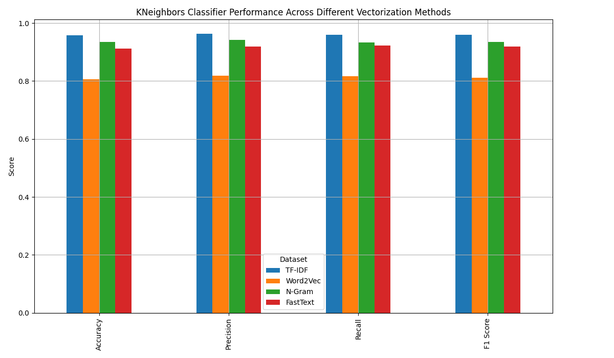

## A Supervised Machine Learning Project for Text Classification 
### Introduction
This project aim is to develop a supervised machine learning pipeline capable of classifying texts into 
predefined and categories. The workflow includes data scraping, text preprocessing, vectorization, 
and the implementation of multiple machine learning algorithms. The final outcome is a fully functional pipeline 
that preprocesses data, trains at least three different models, evaluates their performance, and determines 
the best-performing approach for text classification.
### Utilities
Utility functions are used throughout the project to adjust pandas display settings, write data to CSV files, 
binary data - to pickle files, load the data from these files, split the datasets into training and test sets, 
also into training, validation and test sets, finds and saves unique values from second CSV not in first CSV.
### Data used
A sports articles dataset is used for the project setting, sourced from Sports Illustrated, each labeled with 
their respective categories (e.g., basketball, soccer, football). Articles are scraped using the Python libraries 
`requests` and `BeautifulSoup`, extracting relevant text (title, content) and metadata (category). The structured 
dataset is saved in CSV format, containing:
- `text`: the article content;
- `category`: the predefined category assigned to the article.\
> :memo: **Info:** 2400 articles where scraped and saved for processing.

The main dataset / project features, witch are important for the classifiers choosing, are:\
`General text classification` `Small dataset` `Predefined labels` `Multi-class classification` 
`Structured text features` `Low compute`
### Data Preprocessing
The scraped data are prepared for model training in three main steps:
- initially a missing values are handled, duplicates removed, text columns cleaned, category column extracted, 
categories distribution balanced with `Pandas` library;
- the text is cleaned with `Natural Language Toolkit (NLTK)` (removes HTML tags, punctuation, stopwords, etc.);
- the text is normalized with `NLTK's WordNetLemmatizer` (converts to lowercase, lemmatize (converts words to their 
base form) and `NLTK's PorterStemmer` (stemming reduces words to their root form);
- the text is tokenized and vectorized using **four** methods: `TF-IDF`, `NGRAM`, `Word2Vector`, `FastText` (embeddings).
> :memo: **Info:** 2100 records remaining after handling missing values, removed duplicates.\
> :memo: **Info:** 1270 records remaining after filtering, sampling and some categories dropped.

## Classifiers for Text Classification
Text classification is a fundamental Natural Language Processing (NLP) task that involves assigning predefined 
labels to textual data. Below is a breakdown of different classifiers used for text classification, categorized 
by type and use case. This includes:
```
| Traditional Machine Learning Classifiers | Deep Learning-Based Classifiers (NN's) | Pre-Trained Transformer Models |
```
### 1️⃣ Traditional Machine Learning Classifiers
Traditional ML-based classifiers require **feature engineering** (e.g., TF-IDF, word embeddings) before classification.

| Classifier                            | Best For                                | Pros                                   | Cons                                    | Model Provider        |
|---------------------------------------|-----------------------------------------|----------------------------------------|-----------------------------------------|-----------------------|
| Logistic Regression                   | Binary & multi-class classification     | Simple, efficient, interpretable       | Limited to linear decision boundaries   | `scikit-learn`        |
| Support Vector Machine (SVM)          | Spam detection, sentiment analysis      | Works well for small datasets          | Computationally expensive on large data | `scikit-learn`        |
| Naive Bayes (NB)                      | Email filtering, topic categorization   | Fast, handles small datasets well      | Assumes feature independence            | `scikit-learn`        |
| Random Forest                         | General text classification             | Handles high-dimensional data well     | Slower for large datasets               | `scikit-learn`        |
| Gradient Boosting (XGBoost, LightGBM) | Large-scale classification              | High accuracy, handles imbalanced data | Requires careful tuning                 | `XGBoost`, `LightGBM` |
| k-Nearest Neighbors (k-NN)            | Small datasets, language classification | Simple, non-parametric                 | Slow for large datasets                 | `scikit-learn`        |

👉 **Best For:** Small-to-medium datasets with structured text features (TF-IDF, word embeddings).  
👉 **Libraries:** `scikit-learn`, `XGBoost`, `LightGBM`  

### 2️⃣ Deep Learning-Based Classifiers (Neural Networks)
Deep learning models **learn text representations automatically**, requiring **less feature engineering**.

| Classifier                           | Best For                                      | Pros                               | Cons                                 | Model Provider                   |
|--------------------------------------|-----------------------------------------------|------------------------------------|--------------------------------------|----------------------------------|
| Multilayer Perceptron (MLP)          | General text classification                   | Works well with dense embeddings   | Requires feature engineering         | `TensorFlow`, `Keras`, `PyTorch` |
| Convolutional Neural Networks (CNNs) | Short text classification, sentiment analysis | Captures local patterns in text    | Less effective for long documents    | `TensorFlow`, `Keras`, `PyTorch` |
| Recurrent Neural Networks (RNNs)     | Sequential text classification                | Handles sequential dependencies    | Slower training, vanishing gradients | `TensorFlow`, `Keras`, `PyTorch` |
| LSTMs (Long Short-Term Memory)       | Long text classification, sentiment analysis  | Preserves long-range dependencies  | Computationally expensive            | `TensorFlow`, `Keras`, `PyTorch` |
| GRUs (Gated Recurrent Units)         | Faster alternative to LSTMs                   | Memory efficient                   | Still slower than CNNs               | `TensorFlow`, `Keras`, `PyTorch` |
| Transformers (BERT, RoBERTa, T5)     | Large-scale classification, contextual text   | Best for complex NLP tasks         | Requires GPUs, expensive training    | `Hugging Face Transformers`      |

👉 **Best For:** **Large-scale text classification** with deep contextual understanding.  
👉 **Libraries:** `TensorFlow`, `PyTorch`, `Keras`, `transformers`  

### 3️⃣ Pre-Trained Transformer Models (State-of-the-Art)
Pre-trained **transformer models** have revolutionized NLP, offering state-of-the-art accuracy for text classification.

| Model                       | Provider     | Best For                                             | Pros                                                    | Cons                      |
|-----------------------------|--------------|------------------------------------------------------|---------------------------------------------------------|---------------------------|
| BERT                        | Google AI    | Sentiment analysis, topic classification             | Strong contextual understanding, bidirectional learning | Slow inference            |
| DistilBERT                  | Hugging Face | Fast classification                                  | Lighter than BERT, optimized for speed                  | Slight accuracy trade-off |
| RoBERTa                     | Meta AI      | Text classification, fake news detection             | More robust than BERT                                   | Requires fine-tuning      |
| GPT-4                       | OpenAI       | Zero-shot classification                             | No training required, API-based                         | Requires API access       |
| Text-to-Text Transformer T5 | Google AI    | Multi-task learning (classification + summarization) | Flexible for various NLP tasks                          | Large model size          |
| XLNet**                     | Google AI    | Long-form classification                             | Handles dependencies better than BERT                   | Computationally expensive |
| Longformer                  | Hugging Face | Classification of long articles                      | Optimized for processing long documents                 | Requires large datasets   |

👉 **Best For:** **Large datasets & complex classification tasks**  
👉 **Libraries:** `transformers`, `PyTorch`, `TensorFlow`

A particular classification algorithm outperforms others on particular dataset depending on dataset's structure, shape, 
density and noise. Classifiers evaluated in the project:

| Traditional Classifiers    | Deep Learning-Based Classifiers (NN's)      | Pre-Trained Transformer |
|----------------------------|---------------------------------------------|-------------------------|
| Logistic Regression        | Sequential Recurrent Neural Networks (RNNs) | DistilBERT              |
| Random Forest              | Long Short-Term Memory (LSTM)               |                         |
| Decision Tree              |                                             |                         |
| k-Nearest Neighbors (k-NN) |                                             |                         |

### Traditional Classifiers Performance
#### Traditional Classifiers performance comparison:

#### Traditional Classifiers Performance evaluation metrics:

#### KNeighbors Classifier fine-tuning GridSearchCV params:
- `n_neighbors` 3, 5, 7, 10;
- `weights` uniform, distance;
- `metric` euclidean, manhattan, minkowski.
#### KNeighbors Classifier Best Params Across Different Vectorization Methods:
| Dataset  |     Metric | n_neighbors |     weights | Mean Cross-Validation Accuracy |
|----------|-----------:|------------:|------------:|-------------------------------:|
| TF-IDF   |  euclidean |           7 |    distance |                         0.9056 |
| Word2Vec |  euclidean |          10 |    distance |                         0.7757 |
| N-Gram   |  euclidean |          10 |    distance |                         0.8888 |
| FastText |  euclidean |           7 |    distance |                         0.8515 |
#### KNeighbors Classifier performance comparison Across Different Vectorization Methods:


#### KNeighbors Classifier Confusion Matrix on N-Gram Vectorization:

#### Logistic Regression Classifier fine-tuning GridSearchCV params:
- `threshold` 0.01, 0.1, 1, 10;
- `solver` lbfgs, liblinear, saga;
- `max_iter` 100, 200, 300, 600.
#### Logistic Regression Classifier Best Params Across Different Vectorization Methods:
| Dataset  | Threshold | Max_Iter | Solver |  Accuracy |
|----------|----------:|---------:|-------:|----------:|
| TF-IDF   |        10 |      100 |   saga |    0.9412 |
| Word2Vec |        10 |      200 |  lbfgs |    0.8745 |
| N-Gram   |        10 |      100 |   saga |    0.9255 |
| FastText |        10 |      200 |  lbfgs |    0.8706 |
#### Logistic Regression Classifier Best Params Across Different Vectorization Methods:


#### Logistic Regression Classifier Confusion Matrix on TF-IDF Vectorization:

### Simple Neural Network Model
5.1. Model 1: Simple Neural Network
Architecture:
Input layer: Accepts vectorized text.
Hidden layers: Fully connected layers with activation functions (e.g., ReLU).
Output layer: Softmax for multi-class classification.
Implementation: Use TensorFlow or PyTorch.
Objective: Establish a basic neural network model.
5.2. Model 2: Recurrent Neural Network (RNN) or Transformer
Options:
RNN variants: LSTM or GRU for handling sequential text data.
Transformer-based models: Use BERT, RoBERTa, or similar pre-trained models.
Objective: Leverage advanced deep learning techniques for better performance.
6. Model Evaluation
Steps:
Evaluate each model using the testing dataset.
Compare the performance of the ML classifier, simple NN, and advanced NN.
Use metrics like confusion matrix, precision, recall, and F1-score.
7. Deployment and Visualization
Objective: Make the project interactive and presentable.
Steps:
Deploy the model as a web app using Flask or Streamlit.
Visualize results using charts and graphs (e.g., accuracy comparisons).
8. Conclusion
Summarize:
Key findings from the project.
Challenges faced and how they were addressed.
Future Scope:
Potential improvements (e.g., using more data, fine-tuning models, or adding categories).


# 🏆 Best Pre-Trained Models for Classifying Articles
Since article classification is an NLP (Natural Language Processing) task, you need a model specialized in:
- **Text Classification**
- **Topic Categorization**
- **Context Understanding**
- **Multi-Class Classification**
