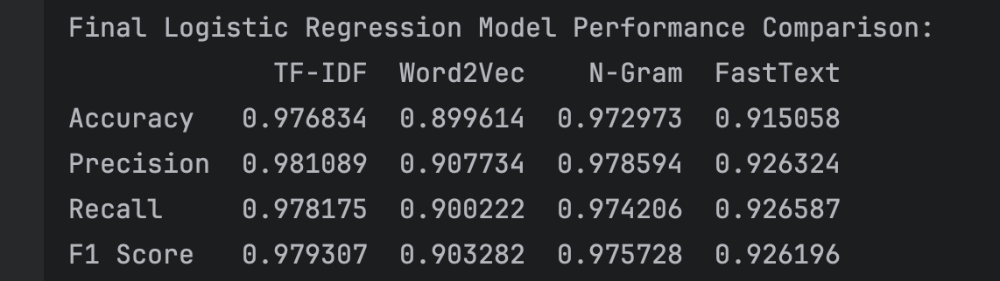
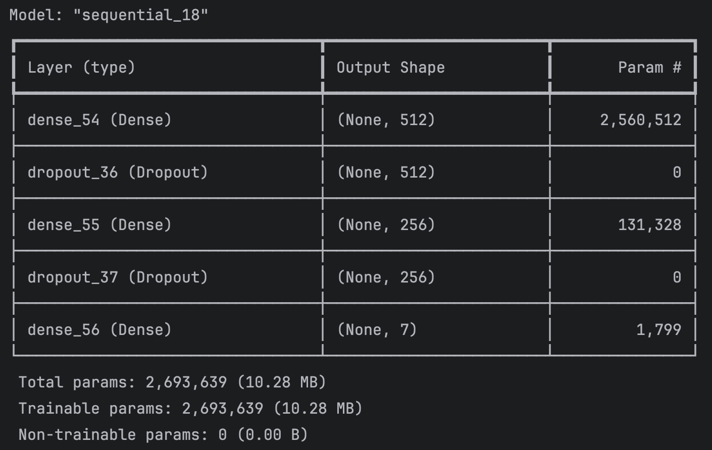
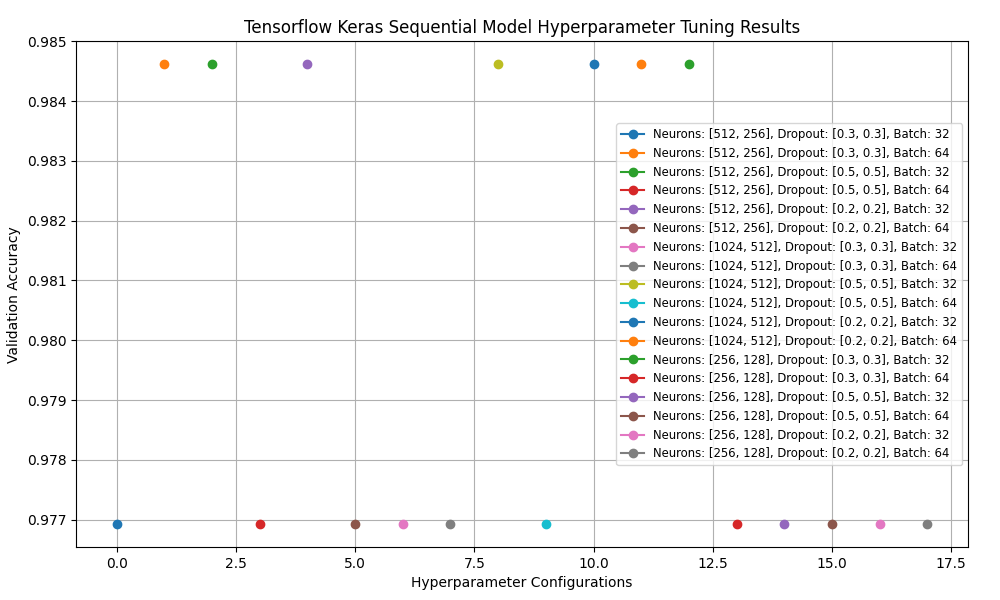

## A Supervised Machine Learning Project for Text Classification 
### Introduction
This project aim is to develop a supervised machine learning pipeline capable of classifying texts into 
predefined categories. The workflow includes data scraping, text preprocessing, vectorization and the implementation 
of multiple machine learning algorithms. The final outcome is a fully functional pipeline that preprocesses data, 
trains at least three different models, evaluates their performance and determines the best-performing approach 
for text classification.
### Utilities
Utility functions are used throughout the project to adjust pandas display settings, write data to CSV files, 
binary data-to pickle files, load the data from these files, split the datasets into training and test sets, 
also into training, validation and test sets, find and save unique values.
### Data Analyzed
A sports articles dataset is used for the project setting, sourced from Sports Illustrated, each labeled with 
their respective categories (e.g., basketball, soccer, football). Articles are scraped using the Python libraries 
`requests` and `BeautifulSoup`, extracting relevant text (title, content) and metadata (category). The structured 
dataset is saved in CSV format, containing:
- `text`: the article content;
- `category`: the predefined category assigned to the article.

Data sample file is accessible in folder `data_sample`.
> :memo: **Info:** 2740 articles where scraped and saved for processing.

The main dataset / project features, witch are important for the classifiers picking, are:\
`General text classification` `Predefined labels` `Small dataset` `Multi-class classification` 
`Structured text features` `Low compute`
### Data Preprocessing
The scraped data are prepared for models training in four main steps:
- a missing values are handled, duplicates removed, category column extracted, categories distribution balanced 
with `Pandas` library;
- the text is cleaned with `Natural Language Toolkit (NLTK)` (removes HTML tags, punctuation, stopwords, etc.);
- the text is normalized with `NLTK's WordNetLemmatizer` (converts to lowercase, lemmatize (converts words to their 
base form) and `NLTK's PorterStemmer` (stemming reduces words to their root form);
- the text is tokenized and vectorized using **3** methods: `TF-IDF`, `Word2Vector`, `FastText` (embeddings), also 
`NGRAM (2, 3)` data preparation applied.
> :memo: **Info:** 2370 records remaining after handling missing values, removed duplicates.\


> :memo: **Info:** 1300 records remaining after filtering, sampling and some categories dropped.

## Picking Classifiers for Text Classification
Text classification is a fundamental Natural Language Processing (NLP) task that involves assigning predefined 
labels to textual data. Below is a breakdown of different classifiers used for text classification, categorized 
by type and use case. This includes (1) Traditional Machine Learning Classifiers, (2) Deep Learning-Based Classifiers 
(NN's), (3) Pre-Trained Transformer Models.
### 1️⃣ Traditional Machine Learning Classifiers
Traditional ML-based classifiers require **feature engineering** (e.g., TF-IDF, word embeddings) before classification.

| Classifier                            | Best For                                | Pros                                   | Cons                                    | Model Provider        |
|---------------------------------------|-----------------------------------------|----------------------------------------|-----------------------------------------|-----------------------|
| Logistic Regression                   | Binary & multi-class classification     | Simple, efficient, interpretable       | Limited to linear decision boundaries   | `scikit-learn`        |
| Support Vector Machine (SVM)          | Spam detection, sentiment analysis      | Works well for small datasets          | Computationally expensive on large data | `scikit-learn`        |
| Naive Bayes (NB)                      | Email filtering, topic categorization   | Fast, handles small datasets well      | Assumes feature independence            | `scikit-learn`        |
| Random Forest                         | General text classification             | Handles high-dimensional data well     | Slower for large datasets               | `scikit-learn`        |
| Gradient Boosting (XGBoost, LightGBM) | Large-scale classification              | High accuracy, handles imbalanced data | Requires careful tuning                 | `XGBoost`, `LightGBM` |
| k-Nearest Neighbors (k-NN)            | Small datasets, language classification | Simple, non-parametric                 | Slow for large datasets                 | `scikit-learn`        |

**Best For:** Small-to-medium datasets with structured text features (TF-IDF, word embeddings).  
**Libraries:** `scikit-learn`, `XGBoost`, `LightGBM`  

### 2️⃣ Deep Learning-Based Classifiers (Neural Networks)
Deep learning models **learn text representations automatically**, requiring **less feature engineering**.

| Classifier                           | Best For                                      | Pros                               | Cons                                 | Model Provider                   |
|--------------------------------------|-----------------------------------------------|------------------------------------|--------------------------------------|----------------------------------|
| Multilayer Perceptron (MLP)          | General text classification                   | Works well with dense embeddings   | Requires feature engineering         | `TensorFlow`, `Keras`, `PyTorch` |
| Convolutional Neural Networks (CNNs) | Short text classification, sentiment analysis | Captures local patterns in text    | Less effective for long documents    | `TensorFlow`, `Keras`, `PyTorch` |
| Recurrent Neural Networks (RNNs)     | Sequential text classification                | Handles sequential dependencies    | Slower training, vanishing gradients | `TensorFlow`, `Keras`, `PyTorch` |
| LSTMs (Long Short-Term Memory)       | Long text classification, sentiment analysis  | Preserves long-range dependencies  | Computationally expensive            | `TensorFlow`, `Keras`, `PyTorch` |
| GRUs (Gated Recurrent Units)         | Faster alternative to LSTMs                   | Memory efficient                   | Still slower than CNNs               | `TensorFlow`, `Keras`, `PyTorch` |
| Transformers (BERT, RoBERTa, T5)     | Large-scale classification, contextual text   | Best for complex NLP tasks         | Requires GPUs, expensive training    | `Hugging Face Transformers`      |

**Best For:** **Large-scale text classification** with deep contextual understanding.  
**Libraries:** `TensorFlow`, `PyTorch`, `Keras`, `transformers`  

### 3️⃣ Pre-Trained Transformer Models (State-of-the-Art)
Pre-trained **transformer models** have revolutionized NLP, offering state-of-the-art accuracy for text classification.

| Model                       | Provider     | Best For                                             | Pros                                                    | Cons                      |
|-----------------------------|--------------|------------------------------------------------------|---------------------------------------------------------|---------------------------|
| BERT                        | Google AI    | Sentiment analysis, topic classification             | Strong contextual understanding, bidirectional learning | Slow inference            |
| DistilBERT                  | Hugging Face | Fast classification                                  | Lighter than BERT, optimized for speed                  | Slight accuracy trade-off |
| RoBERTa                     | Meta AI      | Text classification, fake news detection             | More robust than BERT                                   | Requires fine-tuning      |
| GPT-4                       | OpenAI       | Zero-shot classification                             | No training required, API-based                         | Requires API access       |
| Text-to-Text Transformer T5 | Google AI    | Multi-task learning (classification + summarization) | Flexible for various NLP tasks                          | Large model size          |
| XLNet**                     | Google AI    | Long-form classification                             | Handles dependencies better than BERT                   | Computationally expensive |
| Longformer                  | Hugging Face | Classification of long articles                      | Optimized for processing long documents                 | Requires large datasets   |

**Best For:** **Large datasets & complex classification tasks**  
**Libraries:** `transformers`, `PyTorch`, `TensorFlow`

###  🏆 Selected Classifiers
A particular classification algorithm outperforms others on particular dataset depending on dataset's structure, shape, 
density and noise. Selected Classifiers to evaluate in the project:

| Traditional Classifiers    | Deep Learning-Based Classifiers (NN's)    | Pre-Trained Transformer |
|----------------------------|-------------------------------------------|-------------------------|
| Logistic Regression        | Simple Neural Network (SNN)               | DistilBERT              |
| Random Forest              | Sequential Recurrent Neural Network (RNN) |                         |
| Decision Tree              |                                           |                         |
| k-Nearest Neighbors (k-NN) |                                           |                         |

## Traditional Classifiers Comparison

#### Traditional Classifiers Performance evaluation metrics:

#### KNeighbors Classifier fine-tuning GridSearchCV params:
- `metric` euclidean, manhattan, minkowski;
- `n_neighbors` 3, 5, 7, 10;
- `weights` uniform, distance.
#### KNeighbors Classifier Best Params Across Different Vectorization Methods:
| Dataset  |     Metric | n_neighbors |     weights | Mean Cross-Validation Accuracy |
|----------|-----------:|------------:|------------:|-------------------------------:|
| TF-IDF   |  euclidean |           5 |    distance |                         0.9488 |
| Word2Vec |  euclidean |          10 |    distance |                         0.8164 |
| N-Gram   |  euclidean |           5 |    distance |                         0.9344 |
| FastText |  euclidean |           3 |    distance |                         0.8947 |
#### KNeighbors Classifier Performance Comparison Across Different Vectorization Methods:


#### KNeighbors Classifier Confusion Matrix on TF-IDF Vectorization:

### Logistic Regression Classifier fine-tuning GridSearchCV params:
- `threshold` 0.01, 0.1, 1, 10;
- `solver` lbfgs, liblinear, saga;
- `max_iter` 100, 200, 300, 600.
#### Logistic Regression Classifier Best Params Across Different Vectorization Methods:
| Dataset  | Threshold | Max_Iter |    Solver | Accuracy |
|----------|----------:|---------:|----------:|---------:|
| TF-IDF   |        10 |      100 |     lbfgs |   0.9768 |
| Word2Vec |        50 |      200 | liblinear |   0.9189 |
| N-Gram   |        10 |      100 |     lbfgs |   0.9730 |
| FastText |        50 |      100 | liblinear |   0.9151 |
#### Logistic Regression Classifier Best Params Across Different Vectorization Methods:


#### Logistic Regression Classifier Confusion Matrix on TF-IDF Vectorization:

## Neural Network Models
### Simple Neural Network (SNN)-Tensorflow Keras Sequential Model
It is a simple (basic) fead-forward neural network model. Input layer accepts vectorized text. Hidden layers fully 
connected with activation functions (e.g., ReLU). Output layer softmax for multi-class classification.

#### Data Shape used for SNN tuning:

#### Hyperparameters used for tuning:
- `neurons_list` [512, 256], [1024, 512], [256, 128];
- `dropout_rates_list` [0.3, 0.3], [0.5, 0.5], [0.2, 0.2];
- `batch_sizes` 32, 64;
- `epochs` 100.



### Recurrent Neural Network (RNN)-Long Short-Term Memory (LSTM)
RNN variants are LSTM or GRU designed for handling sequential text data. 

#### FastText dataset results

### Transformer-based models use BERT, RoBERTa, or similar pre-trained models.
Distil Bert Model from pretrained distilbert-base-uncased model Leverages advanced deep learning techniques 
for better performance.


## 🏆 Models Winners in Classifying Articles
### Models Winners in Classifying Articles are _Logistic Regression_ and _Simple Neural Network (SNN)_.
While deep learning models like DistilBERT offer contextual understanding, traditional ML models (Logistic Regression) 
with TF-IDF delivered similar accuracy with significantly lower computational cost. This suggests that for structured 
text datasets, feature engineering remains a powerful tool and deep learning models should be carefully fine-tuned 
to justify their resource requirements.

| Classifier                              |          Vectorizer | Model Size | Accuracy |
|-----------------------------------------|--------------------:|-----------:|---------:|
| Logistic Regression                     |              TF-IDF |       4 KB |   0.9768 |
| k-Nearest Neighbors                     |              TF-IDF |     423 KB |   0.9488 |
| Tensorflow Keras Sequential Model (SNN) |              TF-IDF |    32,4 MB |   0.9768 |
| Distil Bert Base Uncased Model (RNN)    | DistilBertTokenizer |   267,6 MB |   0.8745 |

Find Saved Trained Models Winners and label encoders in `/models` catalog for further training or usage.
## Conclusions
This project aimed to classify text data using various machine learning and deep learning models, leveraging different 
vectorization techniques. We evaluated models ranging from traditional ML classifiers (Logistic Regression, k-NN) 
to deep learning architectures (SNN and RNN-based DistilBERT). The key finding was that Logistic Regression with 
TF-IDF and SNN with TF-IDF performed best, both achieving 97.68% accuracy, demonstrating that traditional models 
can be competitive with deep learning when using appropriate feature engineering. However, DistilBERT (RNN) showed 
lower accuracy (87.45%), suggesting that fine-tuning on this dataset might improve performance.
## Usage
1. Clone the Repository
    ```
    git clone https://github.com/audrbar/ml-sports.git
    cd ml-sports
    ```
2. Create and Activate a Virtual Environment
    ```
    python3 -m venv venv
    source venv/bin/activate
    ```
    On Windows use
    ```
    venv\Scripts\activate
    ```
3. Install Dependencies
    ```
    pip install -r requirements.txt
    ```
4. Run the scripts:
    ```
    main
    ```
5. Load models from `/models` catalog
   ```
   model = joblib.load(model_path)
   ```
6. Load encoders from `/models` catalog
   ```
   label_encoder = pickle.load(label_encoder_path)
   ```
### Future Scope
1. **Fine-Tuning Deep Learning Models:** The performance of DistilBERT (RNN) was lower than expected. Future work 
could involve fine-tuning on domain-specific text data and experimenting with larger transformer models like BERT, 
RoBERTa, or T5 for improved contextual understanding.
2. **Hybrid Model Approaches:** A possible improvement could be combining traditional ML models with deep learning 
embeddings, such as using DistilBERT embeddings as input features for Logistic Regression or k-NN. This could 
provide a balance between accuracy and computational efficiency.
3. **Feature Engineering Enhancements:** Further improvements could be explored by experimenting with different 
vectorization techniques such as fastText, GloVe, or Word2Vec embeddings to see if they provide better representations 
for classification.
4. **Real-Time Classification Pipeline:** Deploying the model in a real-time system with streaming data processing 
using frameworks like Apache Kafka or FastAPI would enhance its practical applicability. Optimizing for low-latency 
predictions will be crucial for scalability.
5. **Multi-Label Classification:** The current approach assumes a single category per text entry. A future extension 
could involve multi-label classification using techniques like sigmoid activation functions or attention mechanisms 
to handle overlapping categories.
6. **Vector Storage in Databases:** Storing text embeddings (vectors) in vector databases like FAISS, Pinecone, Weaviate, 
or Milvus will allow for efficient similarity search and retrieval. This would be useful for semantic search, nearest 
neighbor classification, and recommendation systems. A structured database like PostgreSQL with the pgvector extension 
can also be explored for efficient indexing and querying of embeddings.
7. **Bias and Fairness Analysis:** Analyzing model predictions for bias and fairness across different text categories 
can help ensure the system provides balanced and unbiased predictions, particularly if deployed in sensitive 
applications.
By addressing these areas, the project can be expanded for better accuracy, efficiency, and real-world deployment, 
ensuring adaptability across various text classification tasks.
### Resources
[Performance comparison of multi class classification algorithms](https://gursev-pirge.medium.com/performance-comparison-of-multi-class-classification-algorithms-606e8ba4e0ee)\
[Multiclass Classification](https://builtin.com/machine-learning/multiclass-classification)\
[Towards Data Science](https://towardsdatascience.com/)\
[KDnuggets](https://www.kdnuggets.com/)\
[Analytics Vidhya](https://www.analyticsvidhya.com/)\
[Data Science Central](https://www.datasciencecentral.com/)\
[Medium](https://medium.com/)\
[The batch](https://read.deeplearning.ai/the-batch/)\
[Data Mahadev](https://datamahadev.com/category/analytics/)\
[Paper with code](https://paperswithcode.com/)\
[Random Forest Algorithm](https://builtin.com/data-science/random-forest-algorithm)\
[Machine Learning in Science](https://mindthegraph.com/blog/lt/machine-learning-in-science/)